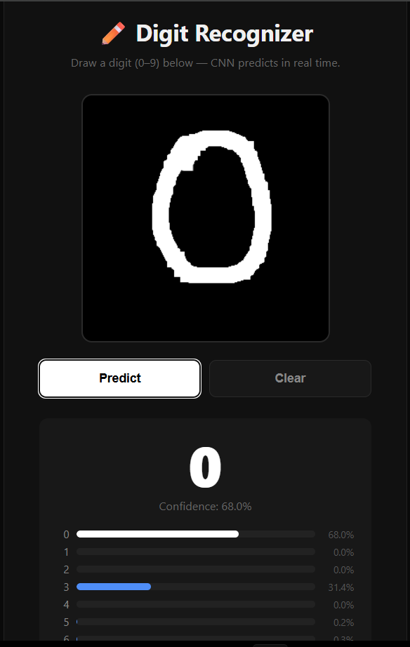

# ✏️ Handwritten Digit Recognizer

CNN trained on MNIST achieving **99%+ test accuracy**. Includes a Flask web app with an HTML5 canvas — draw any digit and get an instant prediction with probability scores.

---

## Features
- Deep CNN (Conv → Conv → Pool → Dropout × 2 → Dense)
- Trains automatically on first run, saves model to disk
- Web UI with draw canvas + probability bar chart
- Touch-screen support (mobile-friendly)
- Processes canvas image → MNIST-compatible 28×28 array

---

## Setup & Run
```bash
pip install -r requirements.txt
python app.py
# Open: http://127.0.0.1:5000
```

On first run, the model trains on MNIST (~2–3 min on CPU). Subsequent runs load the saved model instantly.

---

## Project Structure
```
digit-recognizer/
├── app.py              # Flask app + CNN training
├── digit_model.h5      # Auto-generated after training
├── requirements.txt
└── README.md
```

---

## Model Architecture
```
Input (28×28×1)
→ Conv2D(32) → Conv2D(64) → MaxPool → Dropout(0.25)
→ Conv2D(128) → MaxPool → Dropout(0.25)
→ Flatten → Dense(256) → Dropout(0.5)
→ Dense(10, softmax)
```
Test Accuracy: **~99.2%**

---

## Tech Stack
| Library | Purpose |
|---|---|
| TensorFlow/Keras | CNN model |
| Flask | Web server |
| Pillow | Image preprocessing |
| NumPy | Array operations |

## Result

1)Zero number prediction:
<p align="center">
  
</p>
2)Number Three prediction:
<p align="center">
  
</p>

3)Number Five prediction:
<p align="center">
  
</p>

4)Number Six prediction:
<p align="center">
  
</p>

5)Number Seven prediction:
<p align="center">
  
</p>
